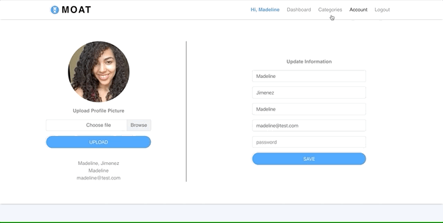
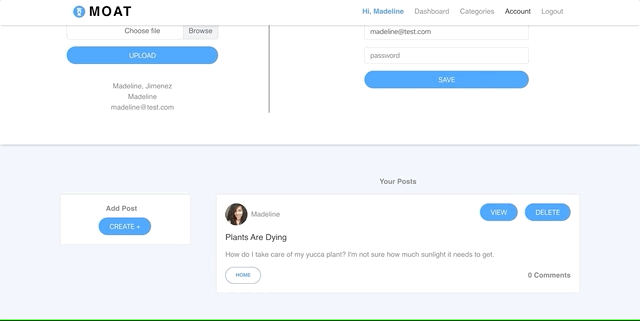

# MOAT (Master of All Trades)

A place for hobbyists and professionals to talk shop. This is a MERN application that allows a user to create a personal account and view a dashboard of questions and answers from experienced people based on categories of interest like "Tech" or "Home".

## Screenshot of Application

### Uploading Profile Picture

### Selecting Category Preferences

### Creating a Post

### Commenting on Post

## Live Link
Launch the application [here](https://master-of-all-trades.herokuapp.com/)

## Technologies Used
- HTML5
- CSS3
- Sass (node-sass npm)
- Bootstrap
- JavaScript
- Mongodb/Mongoose
- Express
- React.js
- Node.js
- Formidable (npm)
- Passport (npm)

## Features
- Create an account
- Update your profile picture
- Update your account information
- Select preferred categories of interest
- Search for questions on dashboard by trending or categories of interest
- Create and post
- Delete a post
- Comment on questions
- Delete comments

## User Story
- AS A hobbyist, amateur or professional with questions related to a topic
- I WANT to be able to make an account to search for or post questions related to specific categories
- SO THAT I can review find or provide answers to questions that experienced people have

## Acceptance Criteria
- GIVEN a user creates an account
- WHEN the user searches for a question or posts a new question
- THEN they can view the details and conversations of a post and contribute

- - -
## Collaborators
[Christian Jones](https://github.com/jonesec2)
[Seohui Choe](https://github.com/schoe14)
[Madeline Jimenez](https://github.com/mijimenez)

